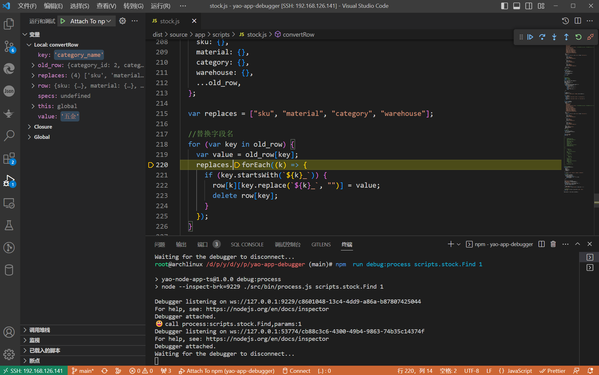

# YAO 应用开发脚本调试工具



## 功能

这个项目提供一个可调试 Yao 应用中的 js 脚本的运行环境。

在 Yao 应用开发过程中，如果 js 脚本的功能比较复杂，代码很长，直接使用 Yao 进行开发调试比较麻烦，需要写很多的 log 或是打印日志。本项目配置了一个在 vscode 里可以调试 yao js 脚本的环境。项目里包含了一系列的处理工具与配置。

**注** 目前只保证能在编辑器`vscode`环境下使用正常。

## 下载本项目

```sh
git clone https://github.com/wwsheng009/yao-app-debugger
cd yao-app-debugger
pnpm i
```

## 开发环境准备

这个调试器的工作原理是把 yao 应用的 js 脚本复制到调试器应用的目录，并且在复制后把 yao 应用中 js 脚本中的特殊处理器进行 nodejs 适配。

当在 nodejs 环境中调用 yao 的处理器时，会通过 http 请求调用 yao 应用服务器中的代理处理器。

### 设置环境变量

```sh
cp .env.sample .env
```

- `YAO_APP_PROXY_ENDPOINT`
  `Yao`应用的访问`API`地址,一般设置成`http://localhost:5099/api/proxy/call`
- `YAO_API_ACCESS_KEY`
  为了接口调用安全，请设置此变量。

- `YAO_APP_ROOT`
  `YAO`应用的根目录，比如：`/data/projects/yao/demos-v1.0/yao-chatgpt/`

- `LOCAL_APP_ROOT`
  本地脚本的目录，设置成`./dist/source/app`

### `Yao`应用设置

这里提供了脚本布署命令，执行脚本复制一些必要的配置文件到 yao 应用目录。一个项目只需要调用一次。

```sh
pnpm run update:yaoapp
```

### 启动 yao 服务。

切换到应用目录，启动 yao 服务

```sh
yao start
```

`Yao`应用启动后，在调试器里才可以远程调用所有`yao`应用中的处理器与`API`。

### 复制 Yao 脚本。

使用脚本把 Yao 的 scripts/services/studio 目录复制到本地目录 dist/source/app 下。文件复制后，脚本会对每一个 js 文件作了处理，在文件头加上必要的引用。在文件尾部也加上必要的函数导出。处理后的 Yao 脚本就能直接在 Nodejs 环境中开发测试。

```sh
pnpm run get:yaoapp
```

复制后的 js 文件会存放在目录 dist/source/app 下，可以在这目录下直接修改或是创建新的 js 脚本。后面会使用脚本复制到 yao 应用目录。

## 调试

### 调试命令

项目里提供了了几个方便调试命令，比如之前使用`yao run scripts.xxxx`,现在需要使用 `pnpm run process scripts.xxxx`，后面是处理器与参数。执行后，会启动调试会话，并等待 vscode 调试连接。

```sh
# process
pnpm run process scripts.test.echo 123 456

# studio
pnpm run studio test.echo 123 456

# services
pnpm run service test.echo 123 456
```

### vscode 启动调试

- `vscode`在运行与调试中时选择调试配置`Attach To npm`。

- 或是 Ctrl+Shift+P 查找命令 Debug: Attach to Node Process command:

## 布署

布署有两种方式

- 实时复制。当你修改目录 dist/source/app 下的文件后，脚本会帮你处理好文件，并复制到 yao 应用目录。

打开新一个终端，执行以下的命令

```sh
pnpm run watch
```

- 目录复制。脚本复制目录 dist/source/app 到 dist/target/app 下，并进行代码处理。默认情况下并不会复制到 Yao 应用目录，主要是这个操作比较危险。

```sh
pnpm run write:target
```

如果确实需要直接复制到 yao 应用目录，也可以使用参数-t，指定 Yao 应用目录。
**注意**：脚本会清空目标目录/scripts/studio/services 下所有的内容。请小心操作。

```sh
pnpm run write:yaoapp -t /yao-app-root-dir/
```

## 注意

如果是开发`studio`脚本,并且在脚本中有写`dsl`文件的操作。需要把`Yao`的环境变量从`YAO_ENV="development"`修改成`YAO_ENV="production"`,防止在脚本运行过程中 Yao 的运行环境被不断的重载

如果在命令行中使用 json 参数，需要注意双引号要加上转义符

```sh
pnpm run process scripts.doc.vector.Match '::{\"pathname\":\"/x/Table\"}' '::[{\"role\":\"user\", \"content\":\"Yao 是什么\"}]'
```

## API 调试

参考：[api debug server](server.md)
